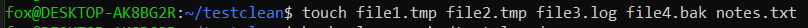
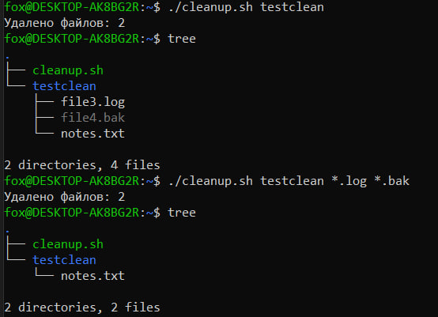
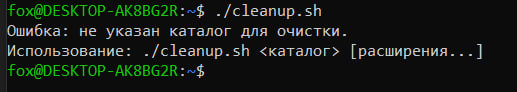

# Скрипт очистки временных файлов

## Описание задания

Цель лабораторной работы — создать Shell-скрипт, который автоматизирует процесс очистки временных файлов в каталоге.

---

## Требования:

- Скрипт должен называться cleanup.sh.

- Скрипт принимает как минимум один аргумент: путь к каталогу, который нужно очистить.

- Остальные аргументы являются необязательными и задают типы файлов для удаления (например, .tmp, .log).

- По умолчанию удаляются файлы с расширением .tmp.

- В конце работы скрипта выводится количество удалённых файлов.

- Скрипт должен проверять существование указанного каталога и выводить соответствующие сообщения об ошибках.

---

## Реализация

Скрипт написан на Bash и выполняет следующую логику:

1. Проверяет, существует ли каталог, указанный в первом аргументе. Если нет — выводит ошибку и завершает работу.

2. Принимает дополнительные расширения файлов как аргументы. Если они не заданы — используется значение по умолчанию .tmp.

3. Перебирает указанные расширения и удаляет соответствующие файлы внутри каталога.

4. Подсчитывает количество удалённых файлов и выводит результат.

## Код скрипта (cleanup.sh)
```bash
#!/bin/bash

# Проверка, передан ли хотя бы один аргумент
if [ -z "$1" ]; then
    echo "Ошибка: не указан каталог для очистки."
    echo "Использование: $0 <каталог> [расширения...]"
    exit 1
fi

TARGET_DIR="$1"
shift

if [ ! -d "$TARGET_DIR" ]; then
    echo "Ошибка: каталог '$TARGET_DIR' не существует."
    exit 1
fi

if [ $# -eq 0 ]; then
    EXTENSIONS=("*.tmp")
else
    EXTENSIONS=("$@")   # все оставшиеся аргументы — это расширения
fi


deleted=0


for ext in "${EXTENSIONS[@]}"; do
    count=$(find "$TARGET_DIR" -type f -name "$ext" -print -delete | wc -l)
    deleted=$((deleted + count))
done

echo "Удалено файлов: $deleted"

```

## Примеры использования

Создана директория testclean:


1. Удалить только .tmp файлы (по умолчанию):

./cleanup.sh ~/testclean


2. Удалить .tmp и .log файлы:

./cleanup.sh ~/testclean .tmp .log



3. Неправильный ввод:

- несуществующий каталог



- не указан каталог для очистки


Вывод

Данный скрипт демонстрирует, как можно автоматизировать рутинные задачи по очистке каталогов.
Он гибкий (поддерживает разные расширения файлов), безопасный (проверяет существование каталогов) и информативный (выводит количество удалённых файлов).